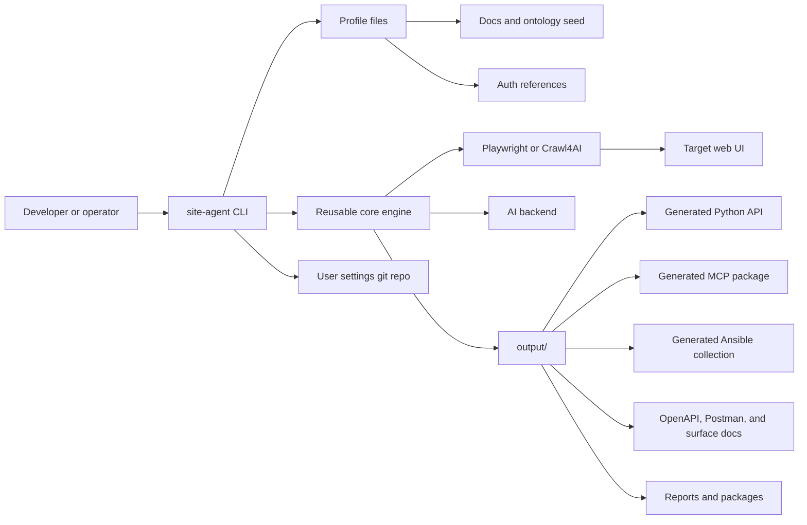
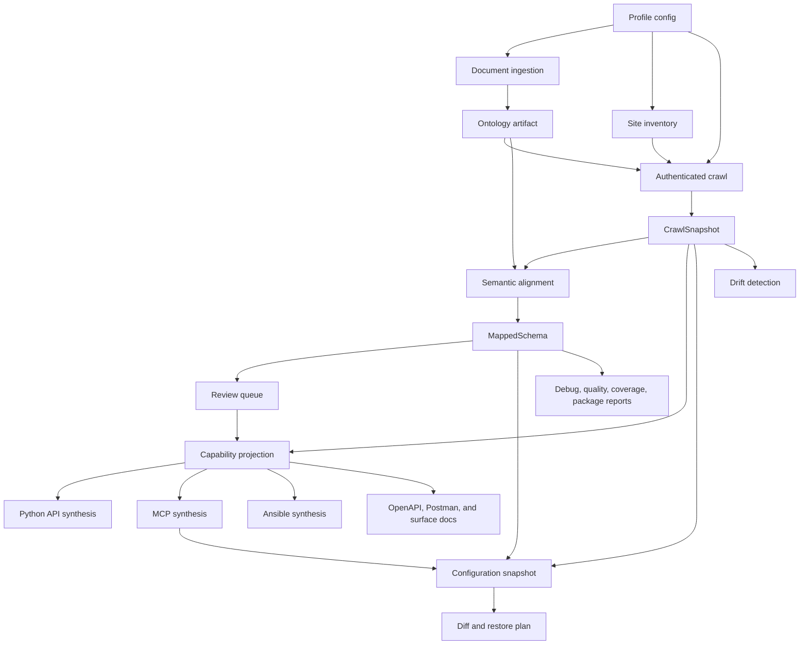
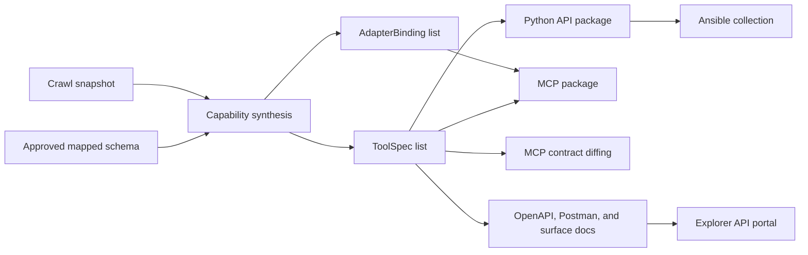

# Architecture

`site-agent` is a product-agnostic engine for learning authenticated web
applications and turning evidence-backed UI models into stable automation
contracts. The reusable core owns crawl, extraction, alignment, synthesis,
drift, configuration versioning, and packaging behavior. Target-specific
knowledge stays in profiles, adapters, settings repositories, and generated
output.

## Architectural Principles

* Keep reusable modules generic and profile-driven.
* Use canonical concepts, evidence IDs, confidence, and risk metadata as public
  contract material.
* Keep selectors, browser locators, cookies, and storage state private to
  adapters and profile runtime files.
* Prefer deterministic artifacts for review, diff, packaging, and restore
  operations.
* Use AI only as an assisted classifier, planner, summarizer, or description
  generator when captured evidence backs the result.
* Generate Python API, MCP, Ansible, OpenAPI, and Postman surfaces from the same
  approved model.
* Default write-like behavior to dry-run, review, or disabled modes unless risk
  policy and confirmation gates permit apply mode.

## System Context



The CLI in `site_agent/cli.py` is the orchestration boundary. It loads profile
configuration, calls core modules, writes artifacts, and reports next-step
guidance. The `site-agent` console command is declared in `pyproject.toml`.

## Layered Data Flow



The public contract is built from approved schema and semantic capabilities.
Low-confidence mappings remain internal or review-required and should not be
promoted to stable public tools.

## Core Boundaries

| Area | Owns | Does not own |
| --- | --- | --- |
| Core engine | Generic crawl, extraction, alignment, synthesis, drift, config versioning, quality, packaging | Product-specific labels, private credentials, generated target packages |
| Profiles | Base URL, host allowlist, auth references, crawl policy, ontology seed, docs, risk policy, tool aliases | Shared engine behavior |
| Generated output | Profile-specific API, MCP metadata, adapter bindings, Ansible collection, reports, knowledge bundles | Reusable source package behavior |
| Settings repositories | User-owned snapshots, normalized settings, restore plans, audit history | Core source files or package metadata |

## Profile And Artifact Layout

Profiles live under `profiles/<name>/`:

```text
profiles/<name>/
  profile.json
  ontology.seed.json
  docs/
  auth/
```

Generated artifacts live under `output/<profile>/`:

```text
output/<profile>/
  ontology/
  crawl/
  schema/
  capabilities/
  mcp/
  api/
  ansible/
  explorer/
  reports/
  restore-plans/
  packages/
```

Configuration snapshots are written to a separate settings repository selected
with `site-agent config save --repo`, not into the engine source tree.

## Data Contracts

The in-process contract types are dataclasses in `site_agent/core/models.py`.
Selected JSON artifact contracts are also represented in `contracts/schemas/`.

| Model | Purpose |
| --- | --- |
| `Evidence` | UI, documentation, review, or system provenance for a decision. |
| `DomainTerm` | Canonical term, aliases, units, constraints, sources, and confidence. |
| `UiElement` | Captured field, status value, button, or control with private selector fingerprint. |
| `Page`, `Form`, `Transition`, `InteractionFlow` | Browser-observed page structure, forms, navigation, and staged workflows. |
| `CrawlSnapshot` | Immutable crawl result keyed by profile and run ID. |
| `ConceptMapping`, `MappedSchema` | Evidence-backed UI-to-domain mapping and review status. |
| `ToolSpec`, `AdapterBinding` | Public semantic tool metadata and private selector/action binding. |
| `PythonApiSpec`, `PythonApiMethod` | Generated Python API contract. |
| `AnsibleCollectionSpec`, `AnsibleModuleSpec` | Generated Ansible collection contract. |
| `DriftReport` | Snapshot comparison output for UI drift. |

Confidence bands are implemented by `confidence_band()`:

| Confidence | Band | Exposure meaning |
| --- | --- | --- |
| `>= 0.85` | `stable` | Public-ready when evidence and risk policy also pass. |
| `0.60` to `0.84` | `experimental` | Review-required or provisional. |
| `< 0.60` | `internal` | Internal-only; do not expose publicly. |

## Crawl Architecture

The primary backend is Playwright in `site_agent/core/crawl/playwright.py`. It
supports host allowlist checks, safe navigation label filtering, AI-assisted
navigation scoring, JavaScript state exploration, browser-observed forms,
dynamic flow probing, read-only value extraction, and artifact redaction.

The optional Crawl4AI backend in `site_agent/core/crawl/crawl4ai_backend.py`
normalizes rendered pages and links into the same `CrawlSnapshot` contract.
Downstream schema review, synthesis, drift, and packaging do not depend on
which live browser backend produced the snapshot.

Fixture crawling uses local HTML directories for deterministic unit,
integration, and benchmark runs.

## Domain Intelligence And AI

Domain intelligence starts from `ontology.seed.json` and Markdown documents
under `profiles/<name>/docs/`. `site_agent/core/ingest/docs.py` extracts seed
terms, document headings, and AI-assisted terms when an AI backend is available.

AI backends implement the protocol in `site_agent/core/ai/backends.py`. Current
paths include noop, fake, and OpenAI Responses implementations. AI may assist
with:

* product and UI domain discovery,
* documentation research summaries,
* field typing and semantic mapping,
* form and action classification,
* crawl prioritization,
* generated descriptions.

Public schema and tool exposure still require evidence IDs, confidence, and
review/risk gates.

## Synthesis Architecture



The generated Python API is intended to be the shared execution layer for higher
surfaces. MCP and Ansible generation currently use the same tool model and
should delegate to generated Python API behavior where practical.
Generated OpenAPI, Postman, quickstart, Python, MCP, and Ansible artifacts
document the selector-free local API bridge and generated automation surfaces.
The generated explorer publishes those artifacts as a consumer-facing portal
with Use, Automate, Audit, and Debug modes. Use and Automate expose generated
operation examples, while Audit retains the evidence-heavy UI/adapter browser
for reviewers.

The local API bridge lives in `site_agent/core/synthesize/http_api.py` and is
served by `site-agent api serve`. It exposes health, OpenAPI, and generated
method endpoints while delegating execution to the same generated runtime used
by MCP calls.

## Runtime And Safety

Generated MCP runtime behavior lives in `site_agent/core/synthesize/runtime.py`.
It supports local tool calls, dry-run/apply modes, browser-backed staged action
execution for approved flows, MCP JSON-RPC handling, `Content-Length` framing,
and newline-delimited JSON compatibility for smoke tests.

High-risk operations require confirmation metadata. Restore apply requires a
profile policy that allows writes, `--mode apply`, `--confirm`, fresh snapshot
readiness, clean settings repository checks, and post-restore verification when
provided.

## Observability

Runs persist artifacts under `output/<profile>/`:

* `crawl/snapshot-<run_id>.json`,
* `ontology/ontology.json`,
* `schema/mapped-schema-<run_id>.json`,
* `reports/site-tree-*.json`,
* `reports/research-session.json`,
* `reports/debug-*.json`,
* `reports/actions-*.json`,
* `reports/quality-*.json`,
* `reports/config-coverage-*.json`,
* generated package manifests and contract files.

These artifacts may include captured values and should be reviewed before
sharing.
